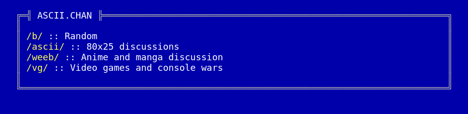
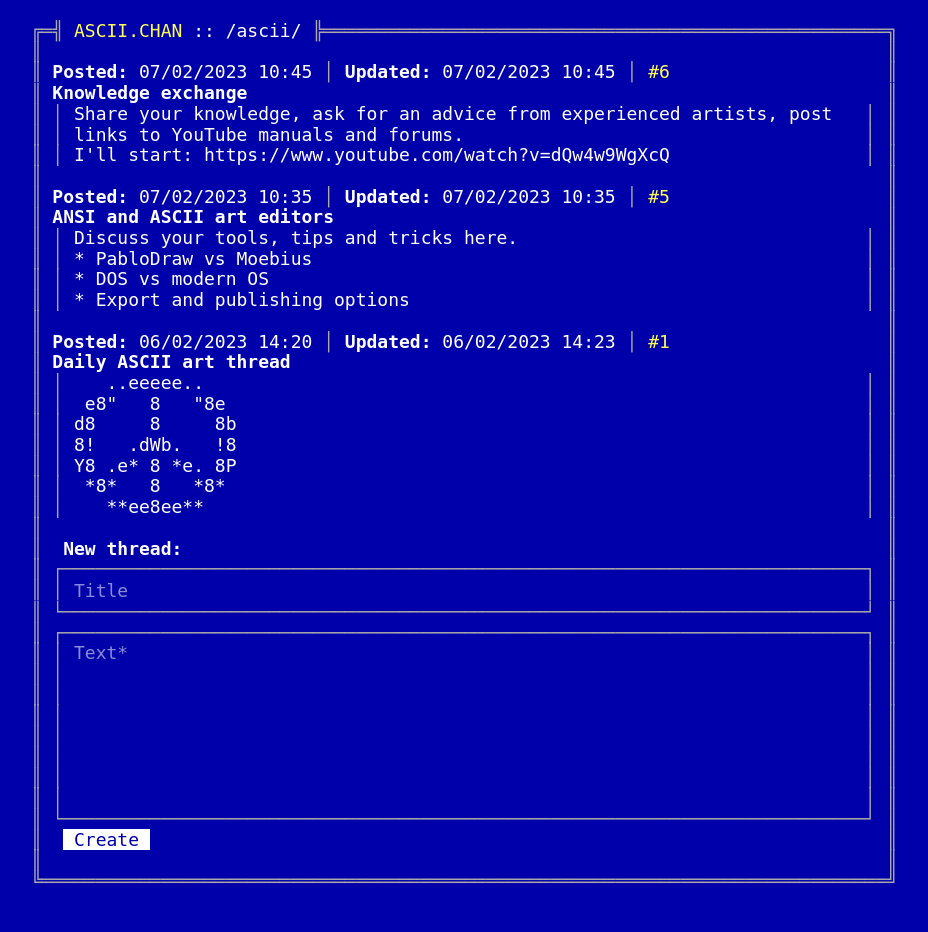
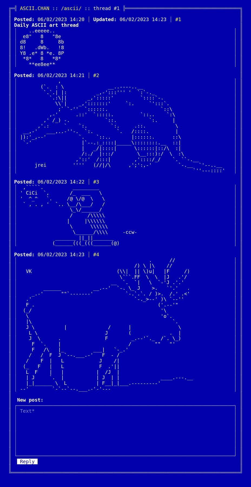

# [ASCII.chan](https://ascii-chan.fly.dev)

```
╔═╣ ASCII.chan ╠═══════════════════════════════════════════════════════════════╗
║                                                                              ║
║ Text-based anonymous forum with retro aesthetics.                            ║
║ Old computers, console applications, demo scene and ASCII art.               ║
║                                                                              ║
╚══════════════════════════════════════════════════════════════════════════════╝
```

## Getting it up and running locally

**Warning!** This project uses PHP built-in server for running the forum.
If you for some reason want to run it in production, please consider using a real web server.

1. Clone the repository:
    ```
    $ git clone https://github.com/torunar/achii-chan.git
    $ cd ascii-chan
    ```
1. Run it in development mode:
    ```
    $ docker build -t ascii-chan .
    $ docker run -d --name=ascii-chan --rm -v $(pwd)/data/storage/:/srv/data/storage -p 8080:8080 ascii-chan
    ```
1. Access ASCII.chan:
    ```
    $ open http://0.0.0.0:8080
    ```

## Managing forum

```
$ composer manage
```

Runs interactive PHP shell where you can use the following functions to manage the forum:
* `createBoard(string $slug, string $displayName)` — creates a board with a specified slug and display name.
* `removeBoard(string $slug)` — removes a board with a specified slug.
* `removeThread(int $id)` — removes thread with a specified ID.

## Screenshots

### Board list


### Board


### Thread

